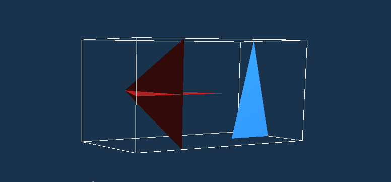

## Запуск

### Запуск самого OpenGL:

```
cmake -B build
cmake --build build --target gl_3d
./build/gl_3d [ --file <file_path> ]
```

### Также можно запускать тесты:
- test_intersection - тесты на пересечение треугольников
- test_end_to_end - тесты на чтение треугольников + поиск пересечений по всему их множеству
- triangle_set_test - тесты для проверки корректности работы алгоритма деления треугольников по ячейкам

## Навигация по полученной графике
- `w` - вперед от камеры (вдоль front-вектора)
- `s` - назад к камере (вдоль front-вектора)
- `a` - влево (вдоль right-вектора)
- `d` - вправо (вдоль right-вектора)
- Движение курсора отвечает за поворот камеры ("осмотр")
- `f` - в fullscreen режим / из fullscreen режима (в начале выставлен в false)
- `\t` - "освобождение" курсора/ "захват" курсора (в начале выставлен в true)
